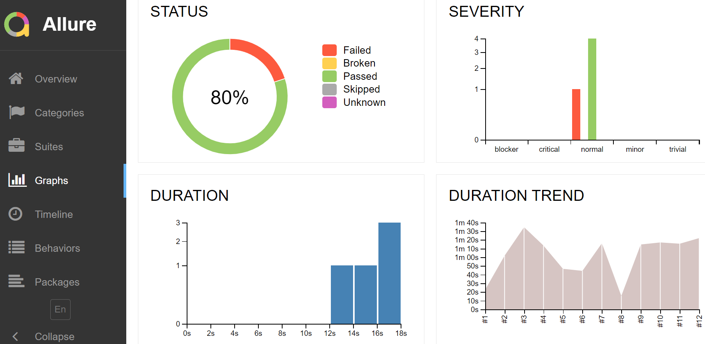
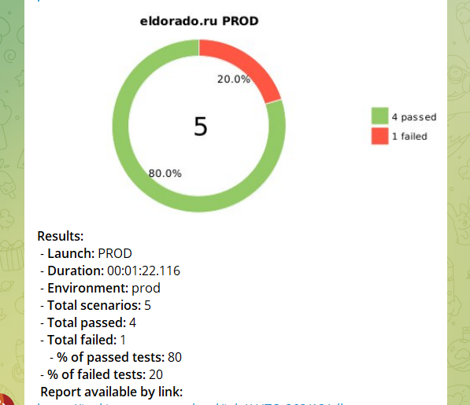

# Проект по автоматизации тестирования для Эльдорадо
<a target="_blank" href="https://www.eldorado.ru">Веб сайт Эльдорадо</a>

## :open_book: Содержание:

- [Технологии и инструменты](#earth_africa-технологии-и-инструменты)
- [Реализованные проверки](#earth_africa-Реализованные-проверки)
- [Сборка в Jenkins](#earth_africa-Jenkins-job)
- [Запуск из терминала](#earth_africa-Запуск-тестов-из-терминала)
- [Allure отчет](#earth_africa-Allure-отчет)
- [Отчет в Telegram](#earth_africa-Уведомление-в-Telegram-при-помощи-бота)
- [Видео примеры прохождения тестов](#earth_africa-Примеры-видео-о-прохождении-тестов)

## :toolbox: Технологии и инструменты

<p align="center">
<a href="https://www.jetbrains.com/idea/"></a>
<a href="https://www.java.com/"></a>
<a href="https://github.com/"></a>
<a href="https://junit.org/junit5/"></a>
<a href="https://gradle.org/"></a>
<a href="https://selenide.org/"></a>
<a href="https://aerokube.com/selenoid/"></a>
<a href="https://github.com/allure-framework/allure2"></a>
<a href="https://www.jenkins.io/"></a>
<a href="https://www.telegram.org/"></a>
</p>

## :heavy_check_mark: Реализованные проверки

- ✓ Главная страница имеет заголовок
- ✓ Отображение окна 'Статус заказа'
- ✓ В логах консоли отсутствуют ошибки
- ✓ Успешный поиск по модели 'logitech m170'
- ✓ Переход в пустую корзину

## :sunglasses: Запуск тестов из терминала

Локальный запуск:
```
gradle clean test
```

Удаленный запуск:
```
clean
test
-Dbrowser=${BROWSER}
-DbrowserVersion=${BROWSER_VERSION}
-DbrowserSize=${BROWSER_SIZE}
-DbrowserMobileView="${BROWSER_MOBILE}"
-DremoteDriverUrl=https://user1:1234@${REMOTE_DRIVER_URL}/wd/hub/
-DvideoStorage=https://${REMOTE_DRIVER_URL}/video/
-Dthreads=${THREADS}
```

## </a> Jenkins job
<p align="center">
<a href="https://jenkins.autotests.cloud/job/10_DikayaAV_unit13/"></a>
</p>

### :maple_leaf: Параметры сборки в Jenkins:

- browser (браузер, по умолчанию chrome)
- browserVersion (версия браузера, по умолчанию 100.0)
- browserSize (размер окна браузера, по умолчанию 1920x1080)
- browserMobileView (название мобильного устройства, для примера iPhone X)
- remoteDriverUrl (адрес удаленного сервера selenoid или grid)
- threads (количество потоков)

## </a> Отчет в Allure report

### :fire: Основное окно

<p align="center">

</p>

### :watermelon: Шаги теста

<p align="center">

</p>

### :sun_with_face: Графики

<p align="center">

</p>

## </a> Уведомление в Telegram при помощи бота

<p align="center">

</p>


## </a> Видео прохождения теста

<p align="center">
 
</p>